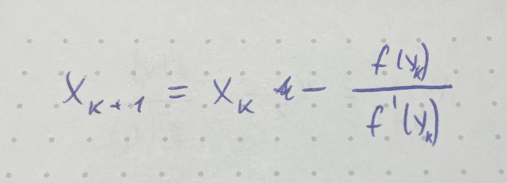
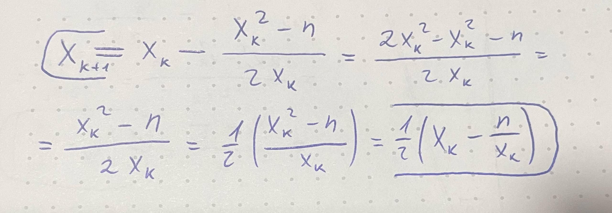

## Отчет по лабораторной работе № 2

#### № группы: `ПМ-2502`

#### Выполнил: `Зубов Константин Олегович`

## Квадратный корень из числа.

### 1. Задание.

> Задание: Написать функцию на Java для вычисления квадратного корня из числа.

### 2. Входные и выходные данные.

#### Данные на вход.

Функция будет принимать один аргумент на вход: <em>double_number</em>

<em>double_number</em> - переменная тип double, в которой передается число, из которого извлекается квадратный корень.

#### Данные на выход.

Функция возвращает одно вещественное число - квадратный корень из <em>double_number</em>.

### 3. Алгоритм.

Для решения данной задачи я решил использовать метод Ньютона. Метод Ньютона - это быстрый способ найти корень уравнения,
следующим алгоритмом:
1. Берем текущее приближение xₖ.
2. Проводим касательную к точке на функции заданную через xₖ.
3. Пересечение касательной с оью OX будет xₖ₊₁.
4. Повторяем это для приближения xₖ₊₁.

#### Формула метода Ньютона:



Для нашей задачи мы берем f(x) = x² - n, где n - это число из которого мы извлекаем корень. Получим следующее уравнение:



Используя данную формулу будем приближаться к искомому значению пока xₖ₊₁ - xₖ > ε, в нашей задачи ε = 1 / 10¹⁰

Перейдем к реализации алгоритма.

### 4. Написание кода.

#### Функция double_to_int().

Данная функция получает на вход вещественное число и возвращает список из двух элементов: минимальное целое число 
полученное в результате умножения переданного числа на 100 и количество операций, которых для этого потребовалось.

Данная функция нужна для увелечения точности работы программы с вещественными числами. Мы будем извлекать корень из 
целого числа, а потом полученный результат делить на 10^l(l - второе значение получаемого в функции списка).

Код данной функции:
```
static long [] double_to_int(double number) {
    long [] answer = new long[2];
    answer[1] = -1;
    while (number * Math.pow(100, answer[1]) != answer[0] && number * Math.pow(100, answer[1]) != answer[0] * 10) {
        answer[1]++;
        answer[0] = (long) (number * Math.pow(100, answer[1]));
    }

    return answer;
}
```

#### Функция sqrt().

Это и есть функция для вычисления квадратного корня. Она получает на вход число из которого необходимо вычислить 
квадратный корень. И возвращает квадратный корень из этого числа.

Далее мы вводим несколько переменных:

1. long [] int_number - это список полученный в результате функции double_to_int() для входящего числа.
2. long number - это первое значение списка int_number, т. е. целое число из которого нужно извлечь корень.
3. long divider - это второе значение списка int_number, т. е. на сколько десяток нужно будет поделить полученный результат.
4. double accuracy - точность или же эпсилон(равен 1 / 10¹⁰).
5. boolean flag - флаг, который сработает когда нужно будет выйти из цикла(изначально равен 0).
6. double step - xₖ(изначально приближение равно самому передаваемому числу).
7. double answer - xₖ₊₁(изначально 0).

Далее запускается цикл и он будет выполнятся пока xₖ₊₁ - xₖ > ε, т. е. step - answer > accuracy. Внутри цикла задана формула 
метода Ньютона для квадратного числа: 0.5 * (step + number / step), а также стоит блок для цикла.

После цикла программа возвращает нам результат деленный на 10^divider.

Код данной функции:

```
static double sqrt(double double_number) {
    long [] int_number = double_to_int(double_number);
    long number = int_number[0];
    long divider = int_number[1];
    double accuracy = 1 / Math.pow(10, 15);
    boolean flag = true;
    double step = number;
    double answer = 0;

    while (flag) {
        answer = 0.5 * (step + number / step);

        if (step - answer < accuracy) {
            flag = false;
        }

        else {
            step = answer;
        }
    }

    return answer / Math.pow(10, divider);
}
```

#### Основная подпрограмма.

Основной функционал написан, так что в основной подпрограмме необходимо ввести число и вызвать функцию для извлечения корня.

(Для тестов я также буду вызывать функцию Math.sqrt())

Код основной подпрограммы:
```
public static void main(String[] args) {
    double number = in.nextDouble();
    out.println(Math.sqrt(number));
    out.println(sqrt(number));
}
```


### Тесты.

>Тест 1.
- **Input**:
```
    2
```

- **Output**:
```
    1.4142135623730951
    1.414213562373095
```

>Тест 2.
- **Input**:
```
    144
```

- **Output**:
```
    12.0
    12.0
```

>Тест 3.
- **Input**:
```
    1,44
```

- **Output**:
```
    1.20
    1.20
```

>Тест 4.
- **Input**:
```
    1,4
```

- **Output**:
```
    1.1832159566199232
    1.1832159566199232
```

>Тест 5.
- **Input**:
```
    132,12365334221
```

- **Output**:
```
    11.494505354394768
    11.494505354394768
```

>Тест 6.
- **Input**:
```
    1441324423243312
```

- **Output**:
```
    3.7964778719799116E7
    3.7964778719799116E7
```